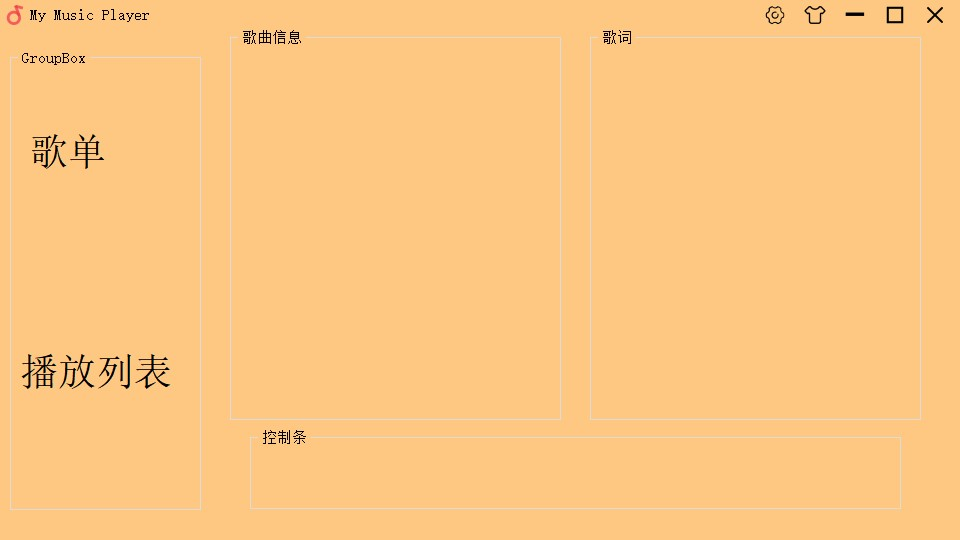

# MyMusicPlayer :musical_note:

# 1.小组构成

| 学号     | 姓名   | 职务 |
| -------- | ------ | ---- |
| 71118204 | 王然   | 组长 |
| 71118104 | 刘丹妮 | 组员 |
| 71118216 | 张煜林 | 组员 |
| 71118314 | 谈金翰 | 组员 |
| 71118315 | 陆舟洋 | 组员 |
#### 项目名称：鬼畜音乐播放器
# 2.项目初步规划
### 代码统一规范

- 每个人提交的源码必须有`完善的注释`
- 命名法统一采用`小驼峰`，在命名里清晰阐述意图
- 太长的行数换行，尽量不要让编译器上出现横向滚轮
- 写出来的东西尽量以Action&类的形式进行封装，方便组件的复用

（其他细节参照老师发的编码规范）

### 我们对项目的模块进行了如下的初步分工：
### 界面模块
#### 窗口
MainWidget //主窗口

SuspensionWindow //小窗口化的悬浮窗

PlayVideo //（播放mv的窗口）

Setting //（设置窗口：开机启动、默认播放器、皮肤。。。）

RegisterWindow //注册界面 (记录脸部信息+完善个人信息)

LoginWindow //登录界面 (扫脸+输密码)

#### 模块
TitleBar //自定义标题栏

ToolBar//顶部的下拉菜单

MusicControl //播放器控制条 （进度条+开始/暂停+上一首/下一首+音量+循环模式）

PlayList //播放列表 （包括播放历史）（QListWidget 点击开始放歌）

SongList //歌单（本地设置，在线获取？）

LyricShow //歌词（+5秒，-5秒，通过点击那一句歌词跳转歌曲进度）

SongInfoShow//歌曲信息（封面，波形图。。。)

SearchBar //搜索栏 （在本地播放列表中搜索&在线搜索）

### 功能模块
SongInfo//歌曲信息模块（标题，艺术家，专辑名，歌词文件的路径，比特率，歌曲长度...）

Client//用户系统（登陆信息，自建歌单，人脸信息...)

LyricShare//歌词海报分享

HandControl //手控制界面

--------

PS：图片统一放在`/res`下

如果这些基础的模块在规定时间内定额完成
我们会考虑增加新的功能模块或在原有的模块上做优化
### 分工

#### 先制作基础的播放器

lzy：封面、歌曲信息

wr：音乐采样和可视化

tjh,ldn：歌词

zyl：歌单
